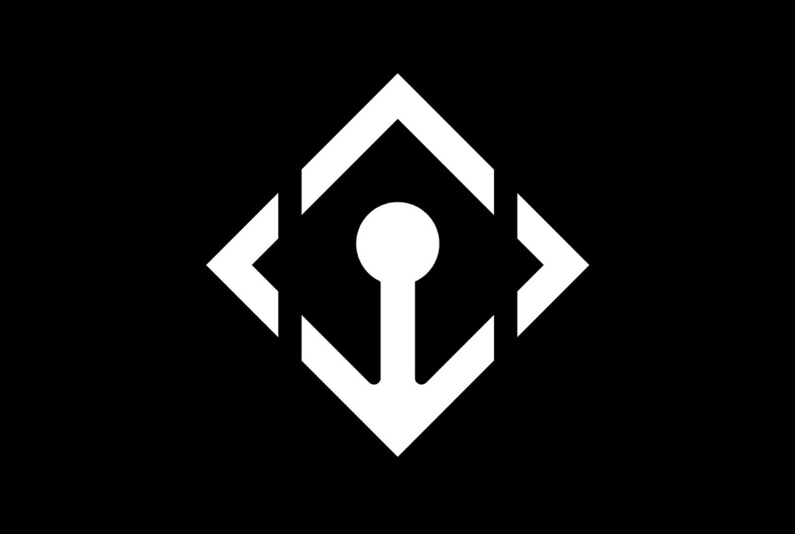
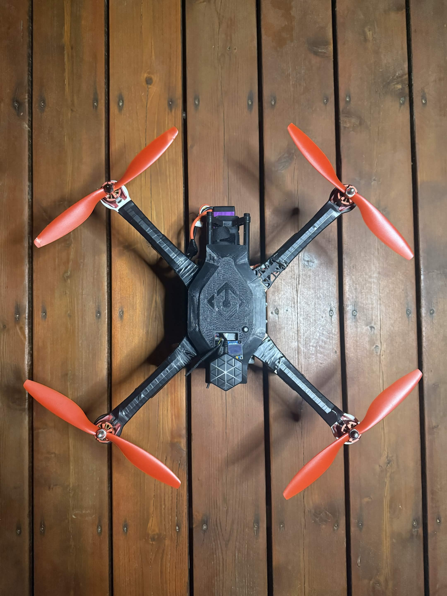
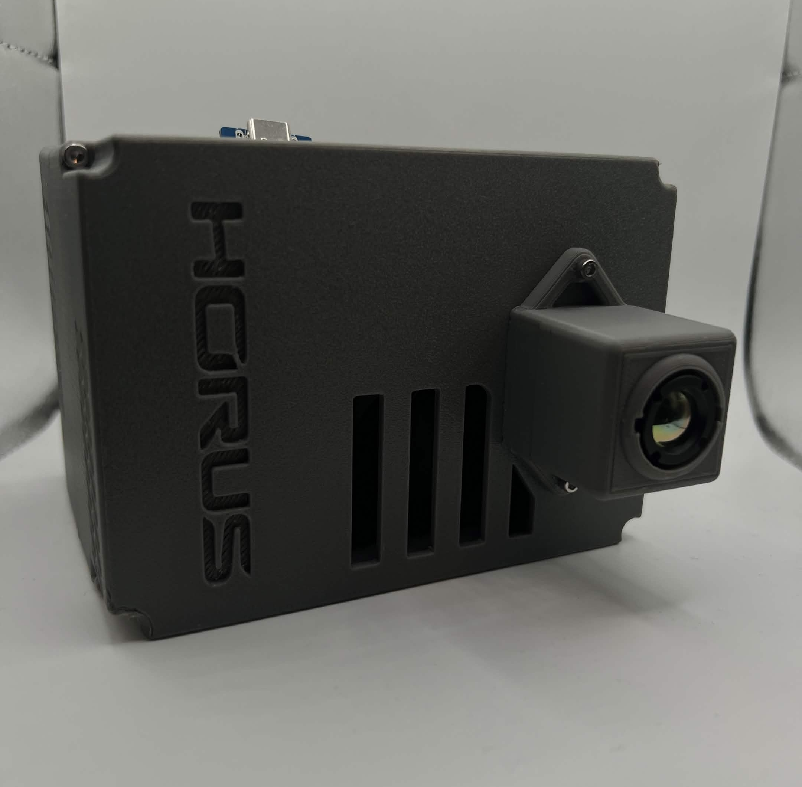
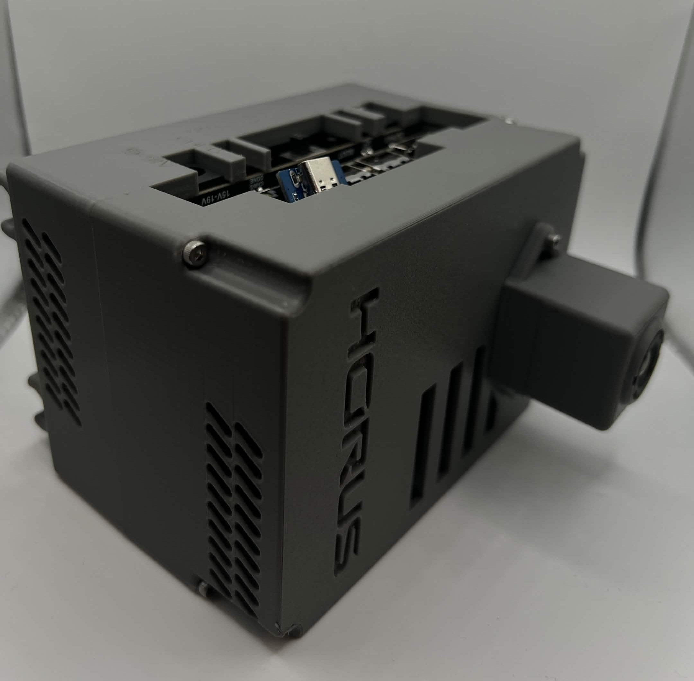
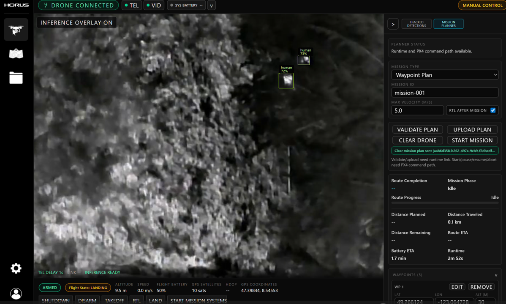
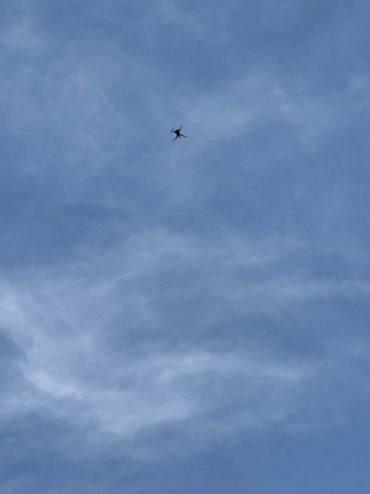

# Building an Offline-First Autonomous Drone Runtime

  

Starting as a mix of a hackathon project and inspiration drawn from our friend's ill-fated hike, Horus was born as an autonomous drone system for search and rescue, designed specifically to make small teams more effective through autonomy, machine learning, and easy-to-use software. The system combines flight control, onboard ML inference, operator workflows, and local radio-based WebSockets into one deployable stack, powering 5km+ autonomous flights.

  
   
  <em>Prototype airframe used to deploy the onboard autonomy, inference, and operator-connected runtime.</em>

## Features And Capabilities We Built Around

- Run our ML, autonomous flight, and search and rescue workflow directly on board the drone
- Integrate with MAVSDK, PX4, and Pixhawk for controls and telemetry
- Detect people from thermal imagery in real time
- Push alerts, telemetry, and runtime state to an operator application
- Keep working over radio without internet connectivity
- Coordinate mission commands, health status, and detection events in one runtime
- Easy-to-use system, deployable in minutes, that makes search teams stronger

## Core Stack

- Onboard Python runtime built around FastAPI, WebSockets, and an ML inference pipeline
- MAVSDK integration for vehicle commands and telemetry streams
- PX4/Pixhawk flight stack integration
- Jetson Orin for onboard compute
- YOLO-based person detection fine-tuned for thermal imagery
- PyTorch to ONNX to TensorRT model optimization path for real-time stability
- React and Tauri operator application

  
  
   
  <em>Custom onboard hardware package containing the runtime compute and thermal sensing stack.</em>

### Runtime Architecture

The onboard runtime was structured as a long-lived Python service that exposed control and state through FastAPI and multiple WebSockets. That choice allowed the system to support both request-response operations and continuous event streaming without splitting the runtime across multiple loosely coordinated services.

At a practical level, the runtime had to coordinate several different flows at once:

- telemetry ingestion from the vehicle
- mission command handling from the operator station
- inference results from the thermal camera pipeline
- runtime health and mode changes
- outbound event streaming to connected clients
- safety gating and the final check layer for autonomous commands

Getting our Python runtime to understand the physical state of the drone, gate unsafe commands, and guide our autonomy in the safest way was a notably difficult challenge.

## Flight Control and Telemetry Integration

MAVSDK provided the interface for vehicle commands and telemetry, with PX4 and Pixhawk underneath as the flight-control layer. The runtime needed to translate operator actions into safe and autonomous command sequences while also normalizing the returning telemetry into a form the UI and autonomy logic could consume consistently.

Important engineering concerns in this layer included:

- command sequencing instead of fire-and-forget RPC behavior
- continuous telemetry updates for position, health, and flight mode
- clear separation between requested state and confirmed vehicle state
- guardrails around mission actions so the UI could not assume a command had succeeded before the aircraft reported it
- implementing a certification system to power secure WebSockets for our incoming commands

That distinction between command intent and confirmed state was a huge hurdle for us to surpass. It was the layer that protected the drone from unsafe maneuvers while ensuring our operators on the ground had up-to-date information, not optimistic guesses.

## Edge Inference on Jetson Orin

The perception pipeline was built for onboard inference on Jetson Orin Nano so that person detection could continue without depending on remote compute. The detection problem centered on thermal imagery for initial detection, which changes the tuning and deployment tradeoffs compared with more common visible-spectrum datasets and pipelines.

The deployment path was:

1. train and validate the model in PyTorch
2. export the model to ONNX
3. optimize and deploy with TensorRT on Jetson

This optimization path was a big improvement for our system's performance. Before switching to TensorRT, our system often dropped frames from the inference queue because too much was backing up in real time, but after switching we eliminated that inference-pipeline lag.

## Detection Alerts and Event Handling

Inference output was not useful by itself. The runtime had to convert detections into operational signals that could power the operator workflow. That meant packaging detection results together with timestamped runtime context and emitting them as events the operator application could act on.

The runtime therefore handled more than bounding boxes. It also managed:

- alert generation when detections crossed operational thresholds
- association of detections with current runtime and mission state
- transport of alerts to the operator application over WebSockets
- synchronization between live detections and the rest of the system state
- an estimate of whether the person we were seeing was new or from a previous encounter

### Operator Application

The operator side used React and Tauri to provide a desktop application that could run close to the mission environment. The application was vital as it had to act as a resilient control surface for mission commands, detection monitoring, and runtime awareness, while also synchronizing with our cloud platform post-mission.

Key responsibilities on the operator side included:

- showing live telemetry and health information
- surfacing detection alerts in real time
- issuing mission or control commands back to the aircraft runtime
- reflecting current runtime state rather than optimistic client assumptions
- staying usable in offline-first or degraded-network conditions

Using Tauri kept the app performant and offline-friendly while still allowing a modern React-based operator interface.

  
   
  <em>Operator application view combining thermal video, live detections, mission planning, and runtime state.</em>

## Offline-First Communications

The system was designed for a radio-based Ethernet connection powered by Microhard. While capable, the bandwidth, latency, and connectivity still vary in the field during operations, which is a constraint that shaped the architecture early. Offline-first was a must.

Offline-first in this context meant:

- onboard autonomy and inference continued even without external connectivity
- operator connectivity was treated as intermittent rather than guaranteed
- WebSocket streams carried live telemetry, alerts, and runtime updates when available
- the runtime remained the source of truth for current vehicle and mission state
- reconnection behavior needed to restore usable state quickly instead of assuming a clean session
- live video feeds degraded before controls and detection information in low-bandwidth environments

  
   
  <em>Field testing under long-range conditions shaped the offline-first communication model.</em>

### Cloud Platform

Our cloud platform, developed in Python with Django, allows Search and Rescue organizations to manage their teams and previous flights. It serves as a source of truth for authorization, command permissions, flight logs, and post-flight videos.

Key responsibilities on the cloud side included:

- acting as the long-term system of record for team membership, operator authorization, command permissions, flight history, and post-flight video review so organizations could manage operations outside the live mission runtime
